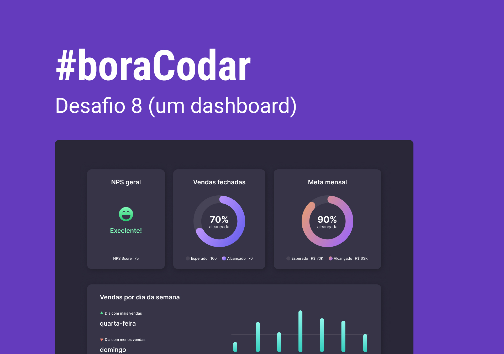
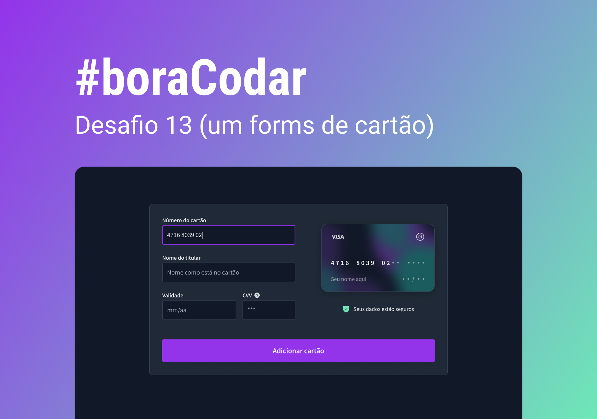
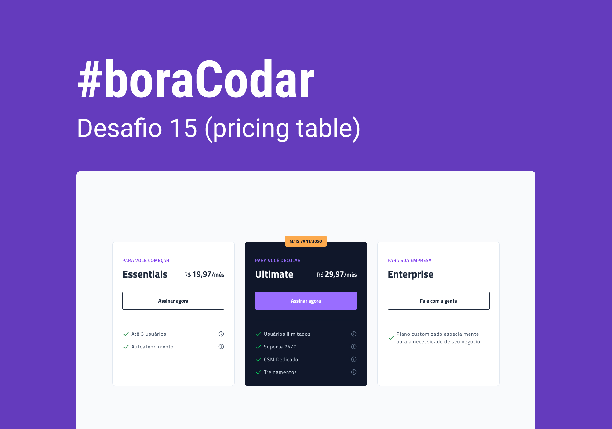
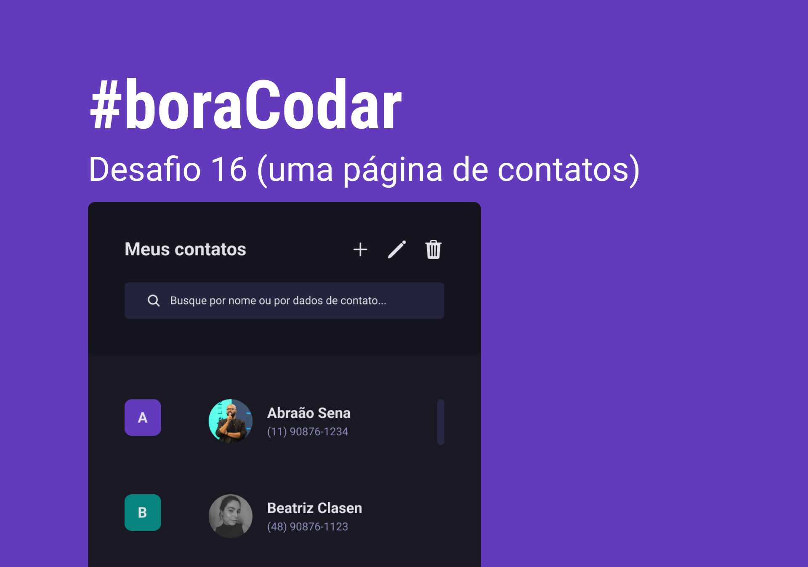
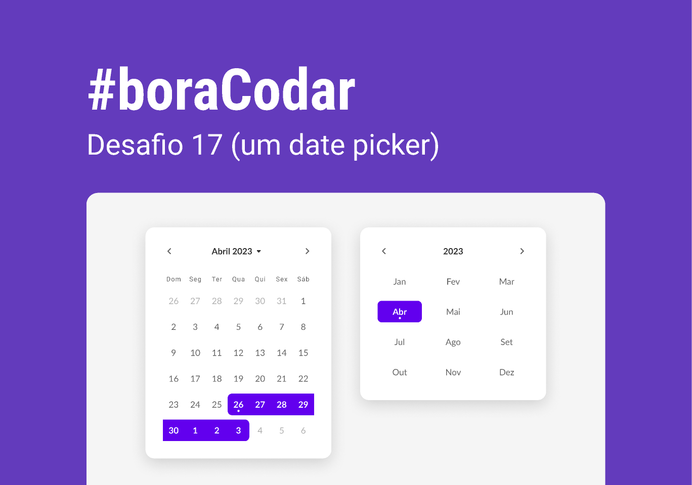

# DesafioBoraCodar

   Projetos de #boraCodar são desafios semanais, promovido pela Rocketseat para ensino de tecnologias WEB  
    <a href="https://boracodar.dev">Acesse o desafio desta semana clicando aqui</a> 
     <table>
    <thead>
        <tr>
            <th align="center">
                 
                

                    <small>#</small>
                

            </th>
            <th align="center">
                 
                
 
                    <small>
                        NAME
                    </small>
                

            </th>
            <th align="left">
                
                
 
                    <small>
                    RELEASE DATE
                    </small>
                

            </th>
            <th align="center">
                
                
 
                    <small>
                    PREVIEW
                    </small>
                

            </th>
        </tr>
    </thead>
    <tbody>
        <tr>
            <td>01</td>
            <td><a href="desafio01-player-de-musica">Music Player </a></td>
            <td>11/01/23</td>
            <td align="center">
            </td>
        </tr>
        <tr>
            <td>02</td>
            <td><a href="desafio02-card-de-produto">Product Card</a></td>
            <td>18/01/23</td>
            <td align="center"></td>
        </tr>
        <tr>
            <td>03</td>
            <td><a href="desafio03-botoes-cursores">Botões e Cursores</a></td>
            <td>25/01/23</td>
            <td align="center"></td>
        </tr>
        <tr>
            <td>04</td>
            <td><a href="desafio04-um-chat">Chat</a></td>
            <td>01/02/23</td>
            <td align="center"></td>
        </tr>
        <tr>
            <td>05</td>
            <td><a href="desafio05-uma-calculadora">Calculadora</a></td>
            <td>08/02/23</td>
            <td align="center"></td>
        </tr>
        <tr>
            <td>06</td>
            <td><a href="06">Cartão de embarque</a></td>
            <td>15/02/23</td>
            <td align="center" ></td>
        </tr>
        <tr>
            <td>07</td>
            <td><a href="desafio07-bloco-carnaval">Site para encontrar seu bloco no carnaval</a></td>
            <td>22/02/23</td>
            <td align="center" ></td>
        </tr>
        <tr>
            <td>08</td>
            <td><a href="desafio08-dashboard">Dashboard</a></td>
            <td>01/03/23</td>
            <td align="center" ></td>
        </tr>
        <tr>
            <td>09</td>
            <td><a href="desafio09-currency-converter">Conversor de moedas</a></td>
            <td>08/03/23</td>
            <td align="center" ></td>
        </tr>
        <tr>
            <td>10</td>
            <td><a href="desafio10-clima">Uma página de clima</a></td>
            <td>15/03/23</td>
            <td align="center" ></td>
        </tr>
        <tr>
            <td>11</td>
            <td><a href="desafio11-login">Uma página de login</a></td>
            <td>22/03/23</td>
            <td align="center" ></td>
        </tr>
        <tr>
            <td>12</td>
            <td><a href="desafio12-kanban">Um Kanban</a></td>
            <td>29/03/23</td>
            <td align="center" ></td>
        </tr>
        <tr>
            <td>13</td>
            <td><a href="desafio13-credit-card">Um formulário de cartão</a></td>
            <td>05/04/23</td>
            <td align="center" ></td>
        </tr>
        <tr>
            <td>14</td>
            <td><a href="desafio14-upload">Um componente de upload</a></td>
            <td>12/04/23</td>
            <td align="center" ></td>
        </tr>
            <tr>
            <td>15</td>
            <td><a href="desafio15-pricing-table">Pricing Table</a></td>
            <td>19/04/23</td>
            <td align="center" ></td>
        </tr>
            <tr>
            <td>16</td>
            <td><a href="desafio16-contact-page">Contact page</a></td>
            <td>26/04/23</td>
            <td align="center" ></td>
        </tr>
            <tr>
            <td>17</td>
            <td><a href="desafio17-date-picker">Date picker</a></td>
            <td>00/00/23</td>
            <td align="center" ></td>
        </tr>
    </tbody>
</table>

